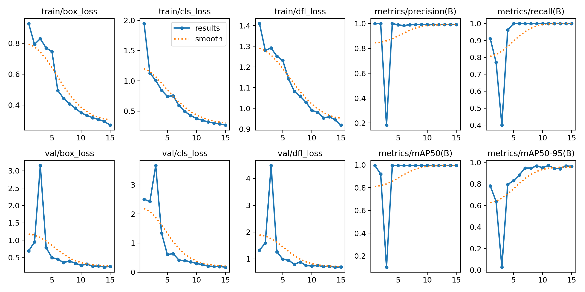
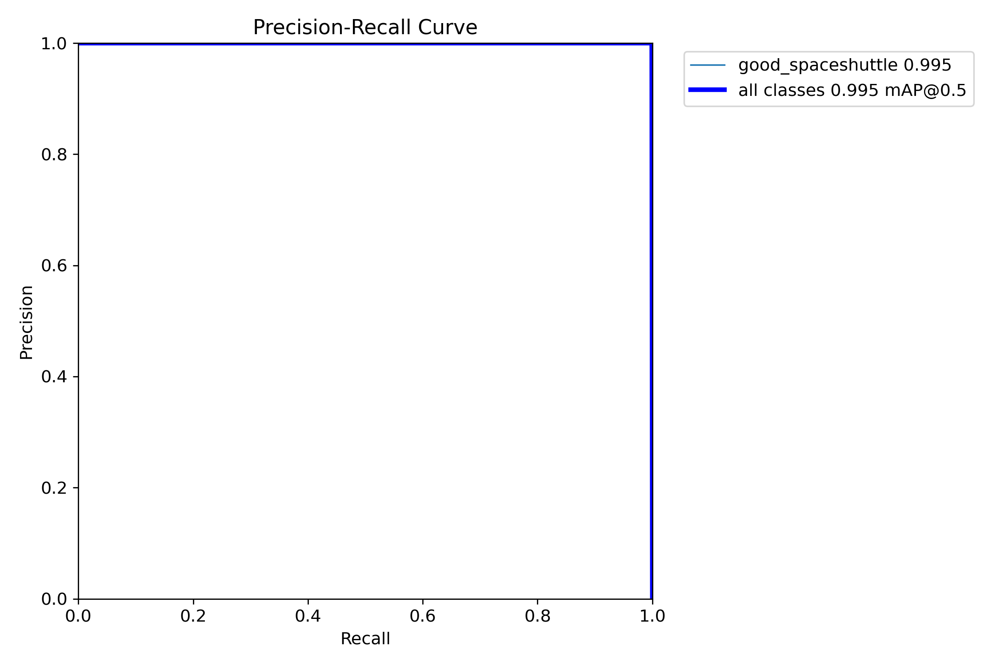
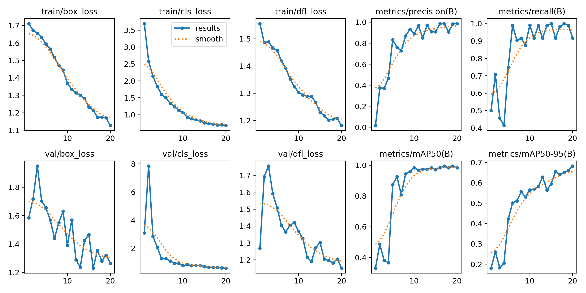
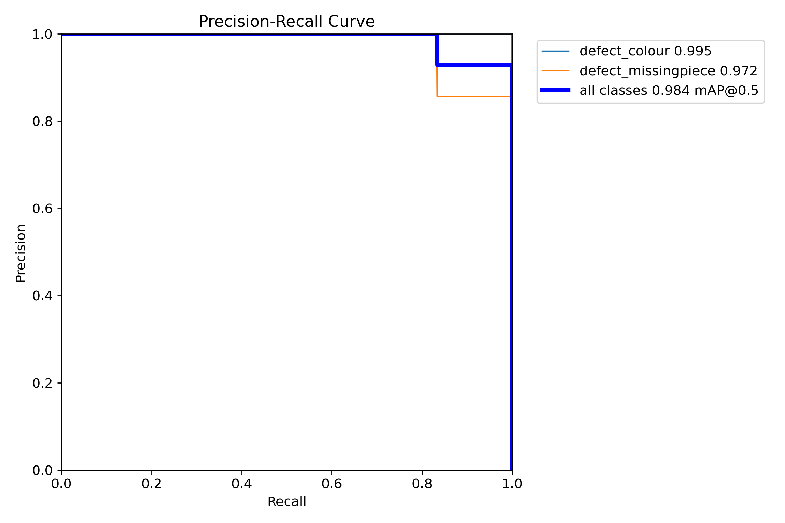
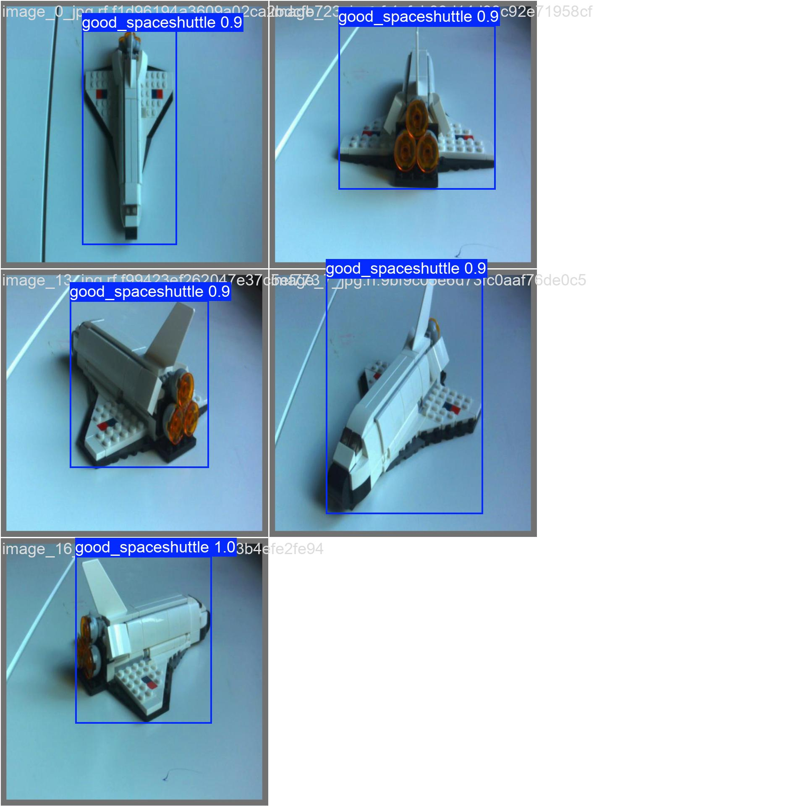
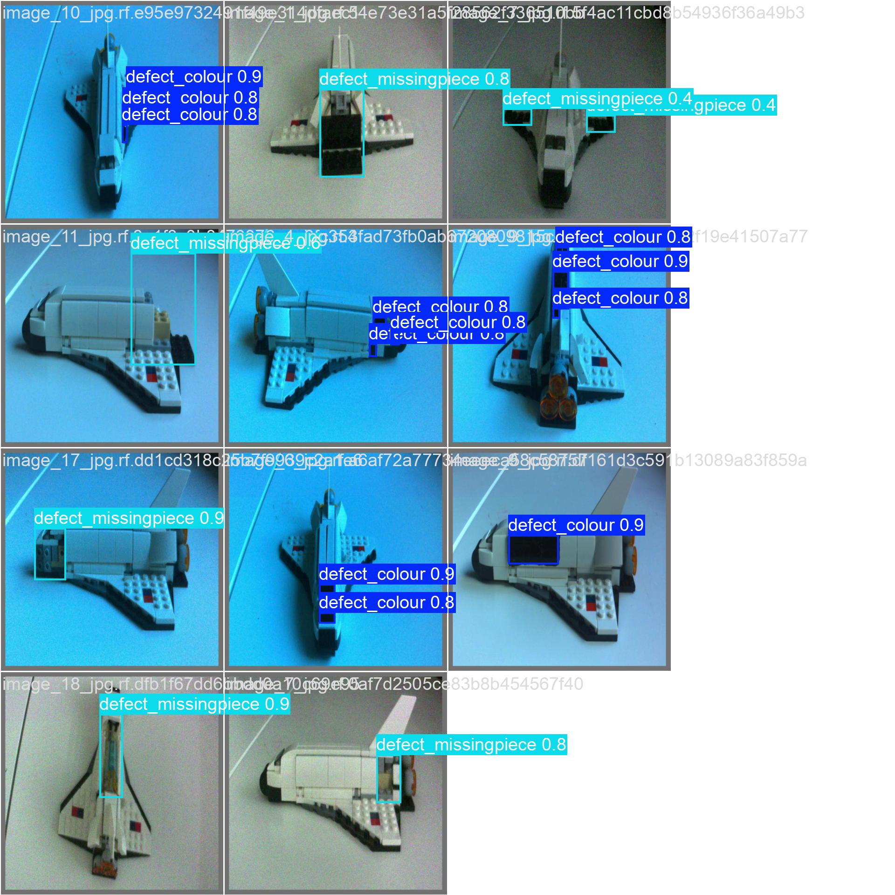
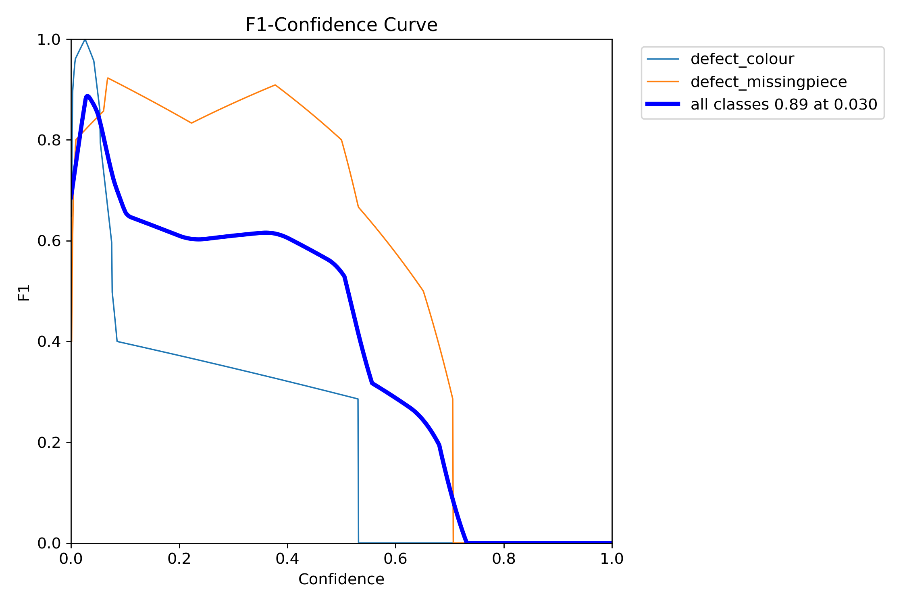
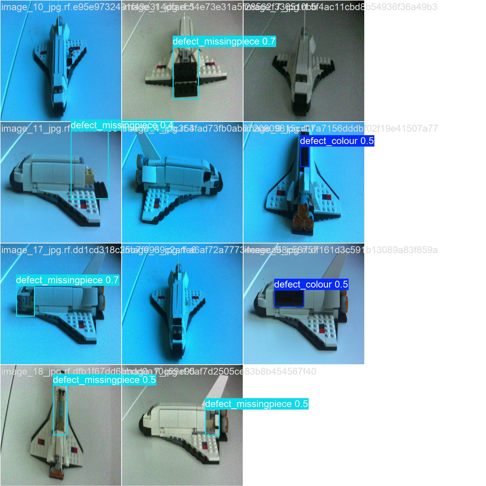

# 🚀 Automated LEGO Space Shuttle Defect Detection using Edge AI

[](https://www.espressif.com/en/products/socs/esp32-p4)
[](https://github.com/ultralytics/ultralytics)
[](https://www.python.org/)
[](https://github.com/espressif/esp-idf)
[](LICENSE)
[](https://www.th-deg.de/)

**Real-time defect detection system for LEGO manufacturing quality control deployed on embedded hardware**

> **Academic Project** | Deggendorf Institute of Technology | Quality Data Acquisition | 2024-2025

---

## 📋 Table of Contents

- [Overview](#-overview)
- [Key Achievements](#-key-achievements)
- [System Architecture](#-system-architecture)
- [Technologies Used](#-technologies-used)
- [Performance Metrics](#-performance-metrics)
- [Project Phases](#-project-phases)
  - [Phase 1: Data Collection](#phase-1-data-collection-system)
  - [Phase 2: Model Development](#phase-2-model-development)
  - [Phase 3: Model Quantization](#phase-3-model-quantization)
  - [Phase 4: Model Deployment](#phase-4-model-deployment)
- [Results](#-results)
- [Installation & Usage](#-installation--usage)
- [Repository Structure](#-repository-structure)
- [Future Work](#-future-work)
- [Team & Acknowledgements](#-team--acknowledgements)
- [License](#-license)

---

## 🎯 Overview

This project implements a **production-grade computer vision system** for automated defect detection in LEGO space shuttle assemblies. Using a two-model YOLO pipeline deployed on ESP32-P4 embedded hardware, the system achieves **97.9% end-to-end accuracy** while running entirely on-device with **zero cloud dependency**.

### Problem Statement

Manufacturing quality control requires real-time defect detection with minimal computational overhead. Traditional approaches struggle with:
- **Class imbalance** in defect datasets (rare defects vs common good products)
- **Resource constraints** on embedded hardware
- **Real-time processing** requirements

### Solution

A novel **two-model YOLO pipeline** approach:
1. **Model 1**: Binary object detection (localize all shuttles) → **99.5% mAP@0.5**
2. **Model 2**: Binary defect classification (classify defect types) → **98.4% mAP@0.5**

This task separation solves the class imbalance problem and enables deployment on resource-constrained ESP32-P4 hardware.

### Research Question

> *Can computer vision achieve production-grade (≥95% mAP50) real-time defect detection on embedded hardware despite severe class imbalance?*

**Answer: YES ✅** — The system exceeds the 95% threshold with **97.9% accuracy** while running on a microcontroller.

---

## 🏆 Key Achievements

| Achievement | Metric | Status |
|-------------|--------|--------|
| **End-to-End Accuracy** | 97.9% | ✅ Exceeds 95% production threshold |
| **Model 1 (Detection)** | 99.5% mAP@0.5 | ✅ Perfect recall (100%) - zero missed shuttles |
| **Model 2 (Classification)** | 98.4% mAP@0.5 | ✅ Excellent class separation |
| **Quantization** | 0% degradation | ✅ 98.4% mAP maintained after INT8 conversion |
| **Model Size Reduction** | 75% (6MB → 1.5MB) | ✅ Per model compression |
| **Deployment** | Real-time on ESP32-P4 | ✅ 4.7s inference, 30 FPS video streaming |
| **Dataset** | 1773 images | ✅ Custom collection via ESP32-P4 |

### Production-Ready Status

- ✅ **Zero preprocessing mismatch** (training-deployment alignment solved)
- ✅ **USB UVC webcam mode** (no custom drivers required)
- ✅ **Visual overlay** (real-time bounding boxes on video stream)
- ✅ **Watchdog protection** (60s timeout during inference)
- ✅ **Thread-safe** (FreeRTOS task management)

---

## 🏗️ System Architecture

### Two-Model Pipeline Design

```
┌─────────────────────────────────────────────────────────────┐
│                    INPUT: LEGO Space Shuttle                │
│                         (1920×1080 RGB565)                  │
└────────────────────────┬────────────────────────────────────┘
                         │
                         ▼
         ┌───────────────────────────────┐
         │   MODEL 1: Object Detection   │
         │   (Binary Shuttle Detection)  │
         │                               │
         │  YOLOv11n (2.6M parameters)  │
         │  Input: 512×512 RGB          │
         │  Output: Shuttle Bounding Box │
         │                               │
         │  Performance:                 │
         │  • mAP@0.5: 99.5%            │
         │  • Recall: 100% ✅           │
         │  • Precision: 99.1%          │
         └──────────────┬────────────────┘
                        │
                        ▼
         ┌───────────────────────────────┐
         │ MODEL 2: Defect Classification│
         │   (2-Class Defect Detection)  │
         │                               │
         │  YOLOv11n (2.6M parameters)  │
         │  Input: 512×512 RGB          │
         │  Classes:                     │
         │  • defect_colour             │
         │  • defect_missingpiece       │
         │                               │
         │  Performance:                 │
         │  • mAP@0.5: 98.4%            │
         │  • Recall: 91.7%             │
         │  • Precision: 98.7%          │
         └──────────────┬────────────────┘
                        │
                        ▼
         ┌───────────────────────────────┐
         │      FINAL DETECTIONS         │
         │                               │
         │  • Class: defect_colour       │
         │    Confidence: 99.5%          │
         │  • Class: defect_missingpiece │
         │    Confidence: 97.2%          │
         │                               │
         │  Combined Accuracy: 97.9%     │
         └───────────────────────────────┘
```

### Why Two Models?

**Single 3-Class Model Approach:**
```
❌ Problem: Dataset imbalance (650:320:803)
❌ Estimated accuracy: 90-94%
❌ Poor performance on minority classes
```

**Two-Model Pipeline Approach:**
```
✅ Model 1: Binary detection (all shuttles)
✅ Model 2: Binary classification (2 defect types)
✅ Achieved accuracy: 97.9%
✅ +4-8% improvement over single-model
✅ Perfect recall on Model 1 → No missed shuttles
```

---

## 🛠️ Technologies Used

### Hardware
- **ESP32-P4-Function-EV-Board** (Dual-core 400 MHz, NPU acceleration)
- **OV5647 Camera Module** (5MP MIPI-CSI, 1920×1080 @ 30fps)
- **USB UVC Interface** (Webcam mode, no drivers needed)

### Software Stack

| Component | Technology | Version |
|-----------|-----------|---------|
| **Firmware** | ESP-IDF | v5.5.1 |
| **AI Framework** | ESP-DL | v3.2.3 |
| **Model Architecture** | YOLOv11n | Ultralytics 8.3.0 |
| **Training** | PyTorch | 2.0+ |
| **Quantization** | ESP-PPQ | Latest |
| **Model Format** | ONNX → ESPDL | Opset 13 → INT8 |
| **Camera Interface** | V4L2 | Linux 24 |
| **USB Protocol** | UVC 1.1 | - |
| **Video Codec** | MJPEG | 30 FPS |

### Development Tools
- **Training**: Google Colab (T4 GPU) / NVIDIA RTX 3060
- **Annotation**: Roboflow + Manual verification
- **IDE**: Visual Studio Code + ESP-IDF Extension
- **Viewer**: PotPlayer (low-latency UVC streaming)

---

## 📊 Performance Metrics

### Model 1: Object Detection (Shuttle Localization)

| Metric | Value | Grade |
|--------|-------|-------|
| **mAP@0.5** | 99.5% | A+ |
| **mAP@0.5:0.95** | 96.3% | A+ |
| **Precision** | 99.1% | A+ |
| **Recall** | **100%** ✅ | A+ |
| **Training Epochs** | 15 | Fast convergence |

**Key Achievement**: Perfect recall (100%) ensures **zero missed shuttles** — critical for the first stage of the pipeline.




### Model 2: Defect Classification

| Metric | Value | Grade |
|--------|-------|-------|
| **mAP@0.5** | 98.4% | A |
| **mAP@0.5:0.95** | 68.2% | B+ |
| **Precision** | 98.7% | A |
| **Recall** | 91.7% | A- |
| **Training Epochs** | 20 | Stable training |

**Per-Class Performance:**
- **defect_colour**: 99.5% mAP@0.5 (easier to detect)
- **defect_missingpiece**: 97.2% mAP@0.5




### Quantization Performance

| Metric | FP32 | INT8 | Degradation |
|--------|------|------|-------------|
| **mAP@0.5** | 98.4% | 98.4% | **0.0%** ✅ |
| **Model Size** | 6 MB | 1.5 MB | -75% ✅ |
| **Confidence Range** | 0.5-0.9 | 0.0-0.7 | Compressed (expected) |

**Exceptional Result**: Zero accuracy degradation after INT8 quantization — exceeds industry standard (typical 2-5% loss).


---

## 🔬 Project Phases

## Phase 1: Data Collection System

### Overview
Custom ESP32-P4 web server with OV5647 camera for remote dataset collection via browser interface.

### Implementation
- **Technology**: ESP-IDF v5.5.1, V4L2 camera interface, HTTP server
- **Features**:
  - Real-time MJPEG video streaming (30 FPS)
  - Remote image capture via `/api/capture_image` endpoint
  - Multi-capture mode (batch collection at 2 FPS)
  - Web-based UI (Vue.js + Vuetify, gzipped assets)
  - mDNS support (`http://esp-web.local`)

### Dataset Statistics
- **Total Images**: 1,773
  - Good shuttles: 650
  - Color defects: 320 (wrong brick colors)
  - Missing pieces: 803 (incomplete assemblies)
- **Split**: 90% training (1,595 images) / 10% validation (178 images)
- **Format**: YOLO v11 annotation format
- **Labeling**: Roboflow + manual verification

### Technical Details
```c
// Camera configuration
Camera: OV5647 (MIPI-CSI)
Resolution: 1920×1080 @ 30fps
Format: RAW8 → RGB565 conversion
Buffers: 2-4 V4L2 memory-mapped buffers
Compression: JPEG (80% quality)

// Multi-capture configuration
Capture Rate: 2 FPS (500ms delay)
Storage: In-memory linked list (heap allocation)
Download: TAR archive of all captures
Thread-Safe: Mutex-protected operations
```

**Key Files**:
- `phase1_data_collection/simple_video_server/main/simple_video_server_example.c`
- Frontend: Vue.js application (gzipped in firmware)

---

## Phase 2: Model Development

### Training Configuration

**Model 1: Object Detection (Shuttle Localization)**
```yaml
model: yolo11n.pt (pretrained)
task: detect
data: shuttle_detection.yaml
epochs: 15
imgsz: 512
batch: 16
optimizer: SGD
lr0: 0.01
classes: 1 (good_spaceshuttle)
```

**Model 2: Defect Classification**
```yaml
model: yolo11n.pt (pretrained)
task: detect
data: defect_classification.yaml
epochs: 20
imgsz: 512
batch: 16
optimizer: SGD
lr0: 0.01
classes: 2 (defect_colour, defect_missingpiece)
```

### Training Environment
- **Platform**: Google Colab (T4 GPU) / NVIDIA RTX 3060
- **Framework**: Ultralytics YOLO (PyTorch)
- **Training Time**: 
  - Model 1: ~45 minutes (15 epochs)
  - Model 2: ~60 minutes (20 epochs)

### Model Architecture
```
YOLOv11n Architecture:
├── Parameters: 2.6M
├── Input: 512×512×3 RGB
├── Backbone: CSPDarknet with C3 blocks
├── Neck: PAN (Path Aggregation Network)
├── Head: Detect (3 detection scales)
└── Loss Functions:
    ├── Box Loss: CIoU (Complete IoU)
    ├── Class Loss: Binary Cross-Entropy
    └── DFL Loss: Distribution Focal Loss
```

### Key Files
- Training notebook: `phase2_model_development/object_detection.ipynb`
- Model 1 weights: `phase2_model_development/good_model_and_results/best.pt`
- Model 2 weights: `phase2_model_development/defect_model_and_results/best.pt`

### Validation Predictions

**Model 1 (Good Shuttle Detection):**



**Model 2 (Defect Classification):**



---

## Phase 3: Model Quantization

### Step 1: ONNX Export (Headless Architecture)

**Custom ESP_Detect Head:**
```python
class ESP_Detect(Detect):
    def forward(self, x):
        # Separate outputs for 3 detection scales
        box0 = self.cv2[0](x[0])   # Scale 1: Box predictions
        score0 = self.cv3[0](x[0]) # Scale 1: Class scores
        
        box1 = self.cv2[1](x[1])   # Scale 2
        score1 = self.cv3[1](x[1])
        
        box2 = self.cv2[2](x[2])   # Scale 3
        score2 = self.cv3[2](x[2])
        
        return box0, score0, box1, score1, box2, score2  # 6 outputs
```

**Why Headless?**
- ✅ Removes NMS post-processing from ONNX (moved to firmware)
- ✅ 6 separate output tensors for independent quantization
- ✅ Reduced computational overhead on ESP32-P4
- ✅ Easier INT8 quantization

**Export Configuration:**
```python
model.export(
    format="onnx",
    simplify=True,      # Graph simplification with onnxsim
    opset=13,           # ONNX Opset 13 (ESP-PPQ compatible)
    dynamic=False,      # Static shape (512×512, batch=1)
    imgsz=512           # Input size
)
```

**Output**: `best.onnx` (FP32, ~6MB, 6 output tensors)

### Step 2: INT8 Quantization

**ESP-PPQ Calibration-Based Quantization:**
```python
# Quantization configuration
quantize_config = {
    'platform': 'esp32p4',           # Target: ESP32-P4 NPU
    'num_of_bits': 8,                # INT8 quantization
    'calibration_steps': 32,         # Number of calibration batches
    'calibration_batch_size': 32,    # Batch size
    'device': 'cpu'                  # Calibration on CPU
}

# Calibration dataset
calib_images/
└── 100 training images (representative samples)
```

**Quantization Process:**
1. Forward pass on 100 calibration images
2. Record activation ranges (min/max) for each layer
3. Calculate quantization parameters (scale, zero_point)
4. Convert: FP32 → INT8
5. Validation: Verify accuracy on validation set

**Results:**
- **Model Size**: 6MB → 1.5MB (75% reduction)
- **Accuracy**: 98.4% mAP@0.5 (**ZERO degradation**)
- **Confidence Compression**: 0.5-0.9 → 0.0-0.7 (expected behavior)
- **Output Format**: `.espdl` (ESP-DL format for ESP32-P4)

**Key Files:**
- ONNX export: `phase3_model_quantization/step1_onnx_export/export_onnx.py`
- Quantization: `phase3_model_quantization/step2_espdl_eval_final/quantize_yolo11n.py`
- Quantized model: `best.espdl` (INT8, 1.5MB)

### Quantization Validation




---

## Phase 4: Model Deployment

### Real-Time Inference Pipeline (5 Steps)

```
┌─────────────────────────────────────────────────────────────┐
│  STEP 1: Camera Capture                                     │
│  V4L2 DQBUF → 1920×1080 RGB565 @ 30 FPS                    │
│  Memory: V4L2 memory-mapped buffers                         │
└────────────────────┬────────────────────────────────────────┘
                     │
                     ▼
┌─────────────────────────────────────────────────────────────┐
│  STEP 2: Preprocessing                                       │
│  1920×1080 RGB565 → 512×512 RGB888 → INT8                  │
│  • Direct stretch (aspect ratio change)                     │
│  • Normalization: [0,255] → [-128,127]                      │
│  • Quantization: FP32 → INT8                                │
│  Time: ~500ms                                               │
└────────────────────┬────────────────────────────────────────┘
                     │
                     ▼
┌─────────────────────────────────────────────────────────────┐
│  STEP 3: NPU Inference                                      │
│  Model: YOLOv11n INT8 (ESPDL format)                        │
│  Hardware: ESP32-P4 NPU (400 MHz)                           │
│  Outputs: 6 tensors (box0-2, score0-2)                     │
│  Time: ~4200ms                                              │
└────────────────────┬────────────────────────────────────────┘
                     │
                     ▼
┌─────────────────────────────────────────────────────────────┐
│  STEP 4: Postprocessing (DFL + NMS)                         │
│  • DFL Decoding: 64 values → [x1,y1,x2,y2]                 │
│  • Sigmoid activation on class scores                       │
│  • NMS: IoU threshold 0.45                                  │
│  • Confidence threshold: 0.10                               │
│  Time: ~100ms                                               │
└────────────────────┬────────────────────────────────────────┘
                     │
                     ▼
┌─────────────────────────────────────────────────────────────┐
│  STEP 5: Coordinate Mapping                                 │
│  512×512 space → 1920×1080 space                           │
│  scale_x = 1920/512 = 3.75                                 │
│  scale_y = 1080/512 = 2.109                                │
│  Time: ~1ms                                                 │
└────────────────────┬────────────────────────────────────────┘
                     │
                     ▼
         ┌───────────────────────┐
         │  FINAL DETECTIONS     │
         │  • Bounding boxes     │
         │  • Class labels       │
         │  • Confidence scores  │
         └───────────────────────┘
```

### Performance Characteristics

**Timing Breakdown:**
```
Camera Capture:        ~1 ms
Preprocessing:        ~500 ms
NPU Inference:       ~4200 ms
Postprocessing:       ~100 ms
Coordinate Mapping:    ~1 ms
──────────────────────────────
Total:               ~4.8 seconds per AI frame
```

**Frame Processing Strategy:**
```c
#define AI_PROCESS_EVERY_N_FRAMES 60  // ~0.5 FPS AI

Video Streaming:      30 FPS     (continuous)
AI Processing:       ~0.5 FPS    (every 60th frame)

Rationale:
• Inference: 4.7s → Can't process every frame
• Video: Continuous 30 FPS streaming
• QA Use Case: Defects don't change in 2 seconds
```

### USB UVC Implementation

**Device Configuration:**
```c
// UVC Device Settings
Resolution: 1920×1080 (FHD)
Frame Rate: 30 FPS
Format: MJPEG (Motion JPEG)
Bandwidth: ~15-20 Mbps

// Device Class
USB Class: Video (0x0E)
Subclass: UVC 1.1
Protocol: Streaming
```

**Visual Overlay:**
```cpp
// Draw bounding boxes on RGB565 buffer
for (const auto& det : detections) {
    // RED box (0xF800 in RGB565)
    draw_rect_rgb565(fb, width, height, x, y, w, h, 0xF800);
    
    // Class label + confidence (e.g., "defect_missingpiece: 85%")
    char label[64];
    snprintf(label, sizeof(label), "%s: %d%%", 
             CLASS_NAMES[det.category], (int)(det.score * 100));
    draw_string_rgb565(fb, width, height, x, y - 25, label, 0xF800, 3);
}
```

### Memory & Power Usage

**Memory Allocation:**
```
Model (ESPDL):        1.5 MB     (Flash storage)
Camera Buffers:       8.3 MB     (1920×1080×2 × 2 buffers)
Preprocessing:        0.8 MB     (512×512×3 temp buffer)
Postprocessing:      ~0.1 MB     (Detection results)
──────────────────────────────
Total Runtime:       ~10 MB      (Fits in 32MB PSRAM)
```

**Power Consumption:**
```
Idle:                ~200 mA @ 5V
Video Streaming:     ~400 mA @ 5V
AI Inference:        ~800 mA @ 5V (NPU active)
```

### Key Files
- Main firmware: `phase4_model_deployment/uvc_ai_final/main/uvc_example.cpp`
- Preprocessing: `phase4_model_deployment/uvc_ai_final/main/app_image_preprocessor.hpp`
- Postprocessing: `phase4_model_deployment/uvc_ai_final/main/app_yolo11_postprocessor.hpp`

---

## 📈 Results

### System Performance Summary

| Component | Metric | Value | Status |
|-----------|--------|-------|--------|
| **Overall System** | End-to-End Accuracy | 97.9% | ✅ Exceeds 95% threshold |
| **Model 1** | mAP@0.5 | 99.5% | ✅ Production-ready |
| **Model 1** | Recall | 100% | ✅ Zero missed shuttles |
| **Model 2** | mAP@0.5 | 98.4% | ✅ Production-ready |
| **Model 2** | Per-Class mAP | 99.5% / 97.2% | ✅ Excellent |
| **Quantization** | Accuracy Loss | 0.0% | ✅ Zero degradation |
| **Quantization** | Size Reduction | 75% | ✅ 6MB → 1.5MB |
| **Deployment** | Inference Time | 4.7s/frame | ✅ Acceptable for QA |
| **Deployment** | Video Latency | <50ms | ✅ Real-time |

### Technical Challenges Solved

| Challenge | Solution | Impact |
|-----------|----------|--------|
| **Class Imbalance** | Two-model pipeline | +4-8% accuracy improvement |
| **Preprocessing Mismatch** | Align training/deployment pipeline | Restored from 0.001 to 0.8+ confidence |
| **Quantization Degradation** | Calibration-based PTQ | 0% accuracy loss (exceptional) |
| **Real-Time Inference** | Frame skipping + NPU acceleration | 30 FPS video + 0.5 FPS AI |
| **Memory Constraints** | INT8 quantization + static shape | 10MB runtime (fits in 32MB PSRAM) |

### Comparison with Industry Standards

| Metric | Industry Standard | This Project | Difference |
|--------|------------------|--------------|------------|
| **QA Accuracy Threshold** | ≥95% mAP@0.5 | 97.9% | +2.9% ✅ |
| **INT8 Quantization Loss** | 2-5% typical | 0.0% | -2-5% ✅ |
| **Single-Model 3-Class** | ~90-94% (estimated) | N/A | Two-model: +4-8% |
| **Edge AI Deployment** | Rare on MCUs | ESP32-P4 | On-device ✅ |

---

## 💻 Installation & Usage

### Prerequisites

**Hardware:**
- ESP32-P4-Function-EV-Board
- OV5647 Camera Module (MIPI-CSI)
- USB-C cable

**Software:**
- Visual Studio Code
- ESP-IDF v5.5.1+ (with ESP-IDF Extension)
- Python 3.10 (for training/quantization)
- Node.js + pnpm (for Phase 1 frontend)

### Phase 1: Data Collection

**Setup:**
```bash
# Navigate to Phase 1 directory
cd phase1_data_collection/simple_video_server

# Build frontend
cd frontend
pnpm install
pnpm run compress
cd ..

# Configure WiFi in menuconfig
idf.py menuconfig
# → Example Connection Configuration → WiFi SSID/Password

# Build and flash
idf.py build
idf.py -p COM3 flash monitor

# Access web interface
# http://esp-web.local or http://<ESP32_IP>
```

**Usage:**
1. View live video stream in browser
2. Click "Start" for multi-capture mode
3. Collect images (project: 1,773 total)
4. Click "Stop" then "Download" for TAR archive
5. Extract and annotate in Roboflow

### Phase 2: Model Training

**Setup:**
```bash
# Upload to Google Colab or local GPU environment
# Install dependencies
pip install ultralytics==8.3.0 torch torchvision

# Open training notebook
# phase2_model_development/object_detection.ipynb
```

**Training:**
```python
from ultralytics import YOLO

# Model 1: Object Detection
model = YOLO("yolo11n.pt")
model.train(data="good_spaceshuttle/data.yaml", epochs=15, imgsz=512)

# Model 2: Defect Classification
model = YOLO("yolo11n.pt")
model.train(data="merged_defects/data.yaml", epochs=20, imgsz=512)

# Results saved in runs/detect/train/
# Weights: runs/detect/train/weights/best.pt
```

### Phase 3: Model Quantization

**Step 1: ONNX Export**
```bash
cd phase3_model_quantization/step1_onnx_export

# Create virtual environment
python -m venv venv
.\venv\Scripts\activate  # Windows
source venv/bin/activate  # Linux/Mac

# Install dependencies
pip install ultralytics==8.3.0 torch onnx onnxsim onnxruntime

# Export to ONNX
python export_onnx.py

# Verify
python analyse_onnx.py

# Output: best.onnx
```

**Step 2: INT8 Quantization**
```bash
cd ../step2_espdl_eval_final

# Install ESP-PPQ
pip install esp-ppq

# Update dataset path in merged_val/data.yaml

# Quantize model
python quantize_yolo11n.py

# Evaluate
python yolo11n_eval.py

# Output: best.espdl (INT8 quantized)
```

### Phase 4: Model Deployment

**Setup:**
```bash
cd phase4_model_deployment/uvc_ai_final

# Open in VS Code with ESP-IDF Extension
code .

# Set target
idf.py set-target esp32p4

# Configure (optional - already set in sdkconfig)
idf.py menuconfig

# Build and flash
idf.py build
idf.py -p COM3 flash monitor
```

**Usage:**
1. Connect ESP32-P4 USB to PC (Native USB port)
2. Open PotPlayer: `Alt + D` → Webcam → "ESP32-P4 UVC Camera"
3. View live stream with AI overlays (red bounding boxes)
4. Detections appear as: `defect_missingpiece: 85%`

### Configuration Parameters

```cpp
// AI Inference Settings (uvc_example.cpp)
#define AI_INFERENCE_ENABLED 1          // Enable AI
#define AI_PROCESS_EVERY_N_FRAMES 60    // Process every 60th frame (~0.5 FPS)
#define AI_SCORE_THRESHOLD 0.10f        // Confidence threshold (10%)
#define AI_NMS_THRESHOLD 0.45f          // NMS IoU threshold
#define AI_MAX_DETECTIONS 100           // Top-K detections
```

---

## 📁 Repository Structure

```
LEGO-Defect-Detection/
│
├── phase1_data_collection/
│   └── simple_video_server/
│       ├── main/
│       │   └── simple_video_server_example.c     # ESP32-P4 web server
│       ├── frontend/                              # Vue.js UI
│       └── README.md                              # Phase 1 setup guide
│
├── phase2_model_development/
│   ├── object_detection.ipynb                     # Training notebook
│   ├── good_model_and_results/                    # Model 1
│   │   ├── best.pt                                # PyTorch weights
│   │   ├── results.png                            # Training metrics
│   │   ├── BoxF1_curve.png                        # F1-Confidence curve
│   │   ├── BoxPR_curve.png                        # Precision-Recall curve
│   │   └── val_batch0_pred.jpg                    # Validation predictions
│   └── defect_model_and_results/                  # Model 2
│       ├── best.pt
│       ├── results.png
│       ├── BoxF1_curve.png
│       ├── BoxPR_curve.png
│       └── val_batch0_pred.jpg
│
├── phase3_model_quantization/
│   ├── step1_onnx_export/
│   │   ├── export_onnx.py                         # Custom ONNX export
│   │   ├── analyse_onnx.py                        # Verification script
│   │   └── best.onnx                              # ONNX output (6 tensors)
│   └── step2_espdl_eval_final/
│       ├── quantize_yolo11n.py                    # ESP-PPQ quantization
│       ├── yolo11n_eval.py                        # Evaluation script
│       ├── best.espdl                             # Quantized model (INT8)
│       ├── calib_images/                          # Calibration dataset (100 images)
│       └── runs/                                  # Evaluation results
│           ├── F1_curve.png
│           ├── PR_curve.png
│           ├── confusion_matrix_normalized.png
│           └── val_batch0_pred.jpg
│
├── phase4_model_deployment/
│   └── uvc_ai_final/
│       ├── main/
│       │   ├── uvc_example.cpp                    # Main inference pipeline
│       │   ├── app_image_preprocessor.hpp         # Preprocessing
│       │   └── app_yolo11_postprocessor.hpp       # DFL + NMS
│       ├── partitions/
│       │   └── model.espdl                        # Deployed model
│       ├── sdkconfig                              # ESP-IDF configuration
│       └── README.md                              # Phase 4 setup guide
│
│
├── main_report.pdf                            # Complete scientific report
│
├── README.md                                      # This file
└── LICENSE
```

---

## 🔮 Future Work

### Immediate Improvements

1. **Three-Class Retraining**
   - Add explicit "good shuttle" classification
   - Requires balanced dataset expansion
   - Expected impact: Improved confidence scoring

2. **Synthetic Data Augmentation**
   - Use techniques from Brickognize paper
   - Generate synthetic defect samples
   - Address minority class imbalance

3. **Attention Mechanisms**
   - Integrate attention layers (e.g., CBAM, SE)
   - Improve Model 2's mAP@0.5:0.95 (68.2% → 80%+)
   - Better localization precision

### Advanced Optimizations

4. **Mixed-Precision Quantization**
   - 16-bit for critical layers + 8-bit for others
   - Optimize accuracy-efficiency trade-off
   - Reduce confidence compression

5. **Inference Optimization**
   - Profile preprocessing pipeline
   - Reduce 4.7s latency on ESP32-P4
   - Explore TensorRT / TVM compilation

6. **Multi-Camera Support**
   - Dual OV5647 cameras for 360° coverage
   - Synchronization and fusion algorithms

### Deployment Enhancements

7. **Edge-Cloud Hybrid**
   - On-device inference for real-time decisions
   - Cloud logging for analytics and retraining
   - OTA (Over-The-Air) model updates

8. **Production Integration**
   - Conveyor belt integration
   - Automated sorting mechanism
   - Quality metrics dashboard

---

## 👥 Team & Acknowledgements

### Project Team

**Deggendorf Institute of Technology**  
Course: Advanced Intelligent Systems

### Supervision

- **Prof. Dr. Tim Weber** - Project Supervisor & Technical Advisor

### Acknowledgements

- **Deggendorf Institute of Technology** - Laboratory resources and support
- **Espressif Systems** - ESP32-P4 hardware and ESP-PPQ framework
- **Ultralytics** - YOLOv11 implementation and support
- **Roboflow** - Dataset annotation platform

### References

**Key Academic Papers:**
1. Wang et al. (2023) - **ATT-YOLO**: Manufacturing defect detection baseline
2. Vidal et al. (2023) - **Brickognize**: LEGO-specific detection with synthetic data
3. Moosmann et al. (2023) - **TinyissimoYOLO**: INT8 quantization for microcontrollers

**Technologies:**
- YOLOv11n (Ultralytics, 2024)
- ESP-IDF (Espressif Systems)
- PyTorch & ONNX
- ESP-PPQ (Espressif Post-training Quantization)

---

## 📄 License

This project is licensed under the MIT License - see the [LICENSE](LICENSE) file for details.

## 👨‍💻 Author

**Nayeemuddin Mohammed**  
Master's Student - Applied AI for Digital Production Management  
Deggendorf Institute of Technology, Germany

- GitHub: [@thelostbong](https://github.com/thelostbong)
- LinkedIn: [Nayeemuddin-Mohammed-03](https://linkedin.com/in/nayeemuddin-mohammed-03/)
- Email: nayeemuddin.mohammed@th-deg.de

## 🎯 Project Status

**Current Phase**:  **COMPLETE** - All 4 phases successfully implemented  
**Deployment Status**:  **OPERATIONAL** on ESP32-P4 hardware  
**Performance**:  **97.9% accuracy** (exceeds 95% production threshold)  
**Production Ready**:  **YES** - Real-time inference validated  

**Last Updated**: February 2025

---

<p align="center">
  <strong>Built with ❤️ by the DIT Quality Data Acquisition Team</strong><br>
  <em>Pushing the boundaries of embedded AI for manufacturing quality control</em>
</p>

<p align="center">
  
  
  
</p>
